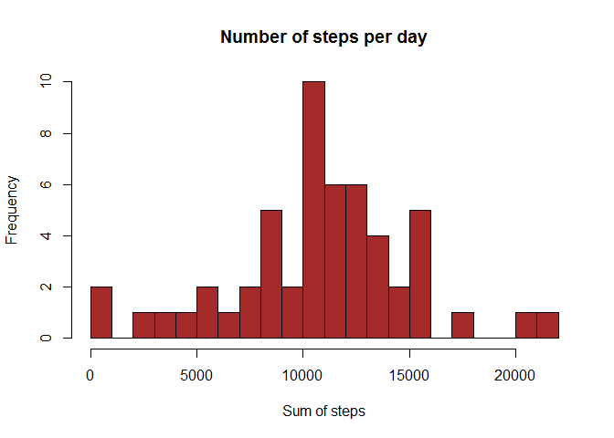
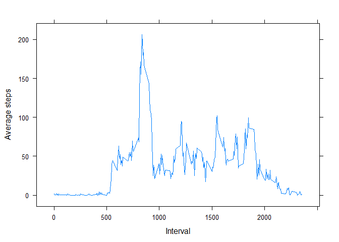

# Reproducible Research: Peer Assessment 1


## Loading and preprocessing the data


```r
file <- unzip("activity.zip")
origDF <- read.csv(file, header = TRUE, sep = ",", na.strings = "NA", nrows = 17568)

imputedDF <- origDF
noNADF <- na.omit(origDF)
```

## What is mean total number of steps taken per day?


```r
# The sqldf library for using SQL to get totals, means, etc. 
# Makes coding much easier
library(sqldf)
```

```
## Loading required package: gsubfn
## Loading required package: proto
## Loading required package: RSQLite
## Loading required package: DBI
```

```r
totSteps <- sqldf("select sum(steps) from noNADF group by date ")
```

```
## Loading required package: tcltk
```

```r
colnames(totSteps) <- "steps"

hist(totSteps$steps , breaks = 25, ylim = c(0,10), col = 'brown', xlab = 'Sum of steps', bg = 'white', main = 'Number of steps per day')
```

 

## What is the mean and median


```r
mmPDate <- sqldf("select date as Date, AVG(steps) as Mean, ((max(steps) + min(steps)) / 2)  as Median from noNADF group by date ")
```
### Report of the Mean and Median

```r
print(mmPDate)
```

```
##          Date       Mean Median
## 1  2012-10-02  0.4375000     58
## 2  2012-10-03 39.4166667    306
## 3  2012-10-04 42.0694444    273
## 4  2012-10-05 46.1597222    277
## 5  2012-10-06 53.5416667    263
## 6  2012-10-07 38.2465278    261
## 7  2012-10-09 44.4826389    374
## 8  2012-10-10 34.3750000    206
## 9  2012-10-11 35.7777778    374
## 10 2012-10-12 60.3541667    401
## 11 2012-10-13 43.1458333    271
## 12 2012-10-14 52.4236111    270
## 13 2012-10-15 35.2048611    393
## 14 2012-10-16 52.3750000    379
## 15 2012-10-17 46.7083333    372
## 16 2012-10-18 34.9166667    379
## 17 2012-10-19 41.0729167    256
## 18 2012-10-20 36.0937500    266
## 19 2012-10-21 30.6284722    250
## 20 2012-10-22 46.7361111    391
## 21 2012-10-23 30.9652778    249
## 22 2012-10-24 29.0104167    266
## 23 2012-10-25  8.6527778    221
## 24 2012-10-26 23.5347222    220
## 25 2012-10-27 35.1354167    277
## 26 2012-10-28 39.7847222    266
## 27 2012-10-29 17.4236111    295
## 28 2012-10-30 34.0937500    261
## 29 2012-10-31 53.5208333    378
## 30 2012-11-02 36.8055556    376
## 31 2012-11-03 36.7048611    266
## 32 2012-11-05 36.2465278    392
## 33 2012-11-06 28.9375000    315
## 34 2012-11-07 44.7326389    383
## 35 2012-11-08 11.1770833    179
## 36 2012-11-11 43.7777778    270
## 37 2012-11-12 37.3784722    271
## 38 2012-11-13 25.4722222    222
## 39 2012-11-15  0.1423611     16
## 40 2012-11-16 18.8923611    237
## 41 2012-11-17 49.7881944    376
## 42 2012-11-18 52.4652778    392
## 43 2012-11-19 30.6979167    394
## 44 2012-11-20 15.5277778    250
## 45 2012-11-21 44.3993056    379
## 46 2012-11-22 70.9270833    283
## 47 2012-11-23 73.5902778    380
## 48 2012-11-24 50.2708333    392
## 49 2012-11-25 41.0902778    275
## 50 2012-11-26 38.7569444    354
## 51 2012-11-27 47.3819444    403
## 52 2012-11-28 35.3576389    366
## 53 2012-11-29 24.4687500    284
```

## What is the average daily activity pattern?


```r
library(lattice)

aveStepsInt <- sqldf("select interval, AVG(steps) as Mean from noNADF group by interval ")
 
xyplot(aveStepsInt$Mean ~ aveStepsInt$interval,
        data = aveStepsInt,
        type = "l", lty = c(1, 2, 2, 1),
        xlab = "Interval", ylab = "Average steps"
       )
```

 

## What is the interval at maximum number of steps


```r
maxInterval <- sqldf(" select interval from aveStepsInt where Mean = (select MAX(Mean) from aveStepsInt)")
printStr <- sprintf("The 5 min interval with maximum number of steps = %d",maxInterval$interval)
print(printStr)
```

```
## [1] "The 5 min interval with maximum number of steps = 835"
```

## Imputing missing values


```r
totalNA <- nrow(origDF) - nrow(noNADF)
printStr <- sprintf("Total number of Missing Values = %d",totalNA)
print(printStr)
```

```
## [1] "Total number of Missing Values = 2304"
```

### The missing values for each interval will be imputed with the 'mean steps value' for that interval from the aveStepsInt data frame above created after removing the missing values.

### Please note that since the mean is being added for each NA for all intervals, it is not going to affect the overall MEAN and MEDIAN.

### The below R code accomplishes this.


```r
# Imputing the NAs with the mean for that interval from the No NAs data frame
for(i in 1:17568) {
        if (is.na(origDF$steps[i])) { 
            imputedDF$steps[i] <- aveStepsInt$Mean[aveStepsInt$interval 
                                             == origDF$interval[i]]
        }
}
colnames(imputedDF) <- c("steps", "date", "interval")
```

## Histogram for imputed values


```r
totSteps2 <- sqldf("select sum(steps) from imputedDF group by date ")
colnames(totSteps2) <- "steps"

hist(totSteps2$steps , breaks = 25, ylim = c(0,10), col = 'brown', xlab = 'Sum of Steps', bg = 'white', main = 'Number of Steps per day')
```

 

## Mean and median for imputed values


```r
mmPDate2 <- sqldf("select date as Date, AVG(steps) as Mean, ((max(steps) + min(steps)) / 2)  as Median from imputedDF group by date ")

mmPDate2$Median <- as.integer(mmPDate2$Median)
```
### Report of the Mean and Median for imputed values

```r
print(mmPDate2)
```

```
##          Date       Mean Median
## 1  2012-10-01 37.3825996    103
## 2  2012-10-02  0.4375000     58
## 3  2012-10-03 39.4166667    306
## 4  2012-10-04 42.0694444    273
## 5  2012-10-05 46.1597222    277
## 6  2012-10-06 53.5416667    263
## 7  2012-10-07 38.2465278    261
## 8  2012-10-08 37.3825996    103
## 9  2012-10-09 44.4826389    374
## 10 2012-10-10 34.3750000    206
## 11 2012-10-11 35.7777778    374
## 12 2012-10-12 60.3541667    401
## 13 2012-10-13 43.1458333    271
## 14 2012-10-14 52.4236111    270
## 15 2012-10-15 35.2048611    393
## 16 2012-10-16 52.3750000    379
## 17 2012-10-17 46.7083333    372
## 18 2012-10-18 34.9166667    379
## 19 2012-10-19 41.0729167    256
## 20 2012-10-20 36.0937500    266
## 21 2012-10-21 30.6284722    250
## 22 2012-10-22 46.7361111    391
## 23 2012-10-23 30.9652778    249
## 24 2012-10-24 29.0104167    266
## 25 2012-10-25  8.6527778    221
## 26 2012-10-26 23.5347222    220
## 27 2012-10-27 35.1354167    277
## 28 2012-10-28 39.7847222    266
## 29 2012-10-29 17.4236111    295
## 30 2012-10-30 34.0937500    261
## 31 2012-10-31 53.5208333    378
## 32 2012-11-01 37.3825996    103
## 33 2012-11-02 36.8055556    376
## 34 2012-11-03 36.7048611    266
## 35 2012-11-04 37.3825996    103
## 36 2012-11-05 36.2465278    392
## 37 2012-11-06 28.9375000    315
## 38 2012-11-07 44.7326389    383
## 39 2012-11-08 11.1770833    179
## 40 2012-11-09 37.3825996    103
## 41 2012-11-10 37.3825996    103
## 42 2012-11-11 43.7777778    270
## 43 2012-11-12 37.3784722    271
## 44 2012-11-13 25.4722222    222
## 45 2012-11-14 37.3825996    103
## 46 2012-11-15  0.1423611     16
## 47 2012-11-16 18.8923611    237
## 48 2012-11-17 49.7881944    376
## 49 2012-11-18 52.4652778    392
## 50 2012-11-19 30.6979167    394
## 51 2012-11-20 15.5277778    250
## 52 2012-11-21 44.3993056    379
## 53 2012-11-22 70.9270833    283
## 54 2012-11-23 73.5902778    380
## 55 2012-11-24 50.2708333    392
## 56 2012-11-25 41.0902778    275
## 57 2012-11-26 38.7569444    354
## 58 2012-11-27 47.3819444    403
## 59 2012-11-28 35.3576389    366
## 60 2012-11-29 24.4687500    284
## 61 2012-11-30 37.3825996    103
```

## Do these values differ from the estimates from the first part of the assignment?

###Comparing the mean/median between the datasets with the missing values removed and the missing values replaced by mean, they look identical. 


## What is the impact of imputing missing data on the estimates of the total daily number of steps?

### There does not seem to be any effect of imputing the NAs with MEAN since the overall mean remains the same and the median is not affected anyway.

### However the 8 days which had all missing values earlier and did not show up in the first report now show up.


## Are there differences in activity patterns between weekdays and weekends?

### The below R code chunk creates a factor variable for separating days into weekdays and weekends.


```r
#create a vector of weekdays
imputedDF$day <- weekdays(as.Date(imputedDF$date))
weekdays1 <- c('Monday', 'Tuesday', 'Wednesday', 'Thursday', 'Friday')
#Use `%in%` and `weekdays` to create a logical vector
#convert to `factor` and specify the `levels/labels`
imputedDF$wDay <-  factor((imputedDF$day %in% weekdays1)+1L,
      levels=1:2, labels=c('weekday', 'weekend'))
```

## Making a time series panel plot for weekdays versus weekends


```r
aveStepsInt2 <- sqldf("select interval,
                      wDay,
                      AVG(steps) as Mean 
                      from imputedDF 
                      where wDay = 'weekday'
                      group by interval ")
aveStepsInt3 <- sqldf("select interval,
                      wDay,
                      AVG(steps) as Mean 
                      from imputedDF 
                      where wDay = 'weekend'
                      group by interval ")


weekDayEndDF <- rbind(aveStepsInt3, aveStepsInt2)


xyplot(Mean ~ interval | wDay, 
        data = weekDayEndDF,
        layout=c(1,2),
        type = "l", lty = c(1, 2, 2, 1),
        xlab = "Interval", ylab = "Number of Steps"
       )
```

 

### The panel plot above shows differences in average steps per time interval for weekdays versus weekends.


